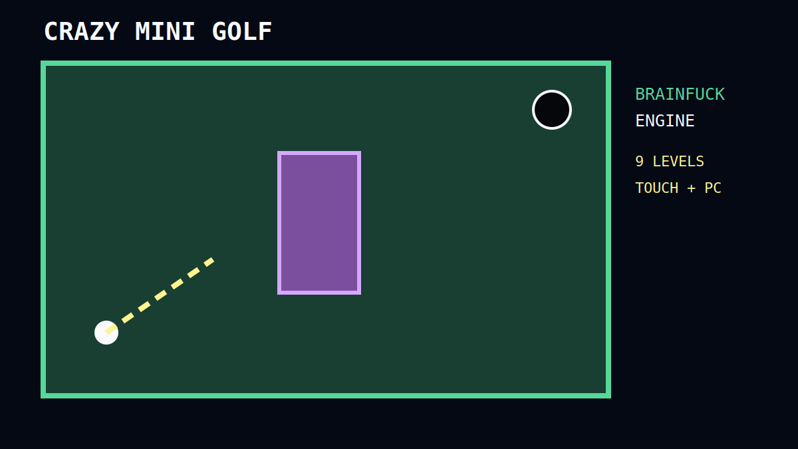

# Crazy Mini Golf

A complete nine-hole, top-down browser minigolf game whose authoritative state transitions run through a real Brainfuck program. The surrounding TypeScript host provides safe browser integration, rendering, input, declarative geometry and persistence.



## Features

- Nine increasingly difficult, declarative levels
- Mouse, touch and keyboard controls
- Eight-direction retro aiming with adjustable power
- Integer ball motion, friction, wall/obstacle rebounds and hole capture
- Rectangular and circular obstacles
- Per-level strokes, par, total relative score and local highscores
- Pause, restart and unlocked-level selection
- Responsive Canvas UI with generated Web Audio effects
- Brainfuck execution in a Web Worker with tape, output and step limits
- Deterministic Vitest suite and GitHub Actions CI
- R simulations for solvability estimates, expected strokes and par suggestions
- Isolated TrumpScript-compatible commentary and alternative result labels

## Languages and responsibilities

| Language                              | Responsibility                                                                                                                                                                                                                                                          |
| ------------------------------------- | ----------------------------------------------------------------------------------------------------------------------------------------------------------------------------------------------------------------------------------------------------------------------- |
| **Brainfuck**                         | Authoritative state packet, current level, position, velocity magnitudes/signs, strike application, strength, stroke count, signed movement, friction decrements, bounce response, collision status, stationary value, hole/completion flags, reset and level increment |
| **TypeScript**                        | Brainfuck interpreter, worker transport, packet conversion, browser input, Canvas rendering, arbitrary level geometry sensors, audio, UI, errors and Local Storage                                                                                                      |
| **HTML/CSS**                          | Responsive application shell, HUD, controls and retro presentation                                                                                                                                                                                                      |
| **R**                                 | Offline shot simulation, coarse solvability checks, expected-stroke estimates, suggested par and CSV/JSON/PNG output                                                                                                                                                    |
| **TrumpScript compatibility grammar** | Non-critical commentator phrases and non-authoritative grades                                                                                                                                                                                                           |
| **Node.js/Vite**                      | Development server, test/build tooling and production bundling                                                                                                                                                                                                          |

## Honest Brainfuck boundary

`src/brainfuck/engine.bf` is not a decorative snippet. It is canonical Brainfuck executed for every strike, physics tick, reset, hole capture and level transition. It mutates a documented 8-bit tape state and returns the only state accepted by the game.

Arbitrary rectangle/circle intersection tests are intentionally performed by TypeScript because encoding dynamic JSON geometry in Brainfuck would make the engine fragile and unreviewable. TypeScript emits compact `blockX`, `blockY` and `holeSensor` bits; Brainfuck owns the collision response, sign reversal, penetration suppression, speed decay and resulting gameplay state. See [architecture](docs/architecture.md), [protocol](docs/protocol.md) and [tape map](src/brainfuck/memory-map.md).

## Installation

Requirements: Node.js 20 or newer and npm.

```bash
npm install
npm run dev
```

Open the Vite URL shown in the terminal.

## Controls

- **Mouse/touch:** point from the ball toward the desired target, drag to adjust power and release to strike
- **Left/Right or A/D:** rotate aim by 45 degrees
- **Up/Down or W/S:** change power
- **Space:** strike
- **R:** restart current level
- **P or Escape:** pause/resume

The side panel also provides angle, power and hit controls for mobile play and accessibility.

## Commands

```bash
npm run dev               # development server
npm run build             # strict TypeScript check and production bundle
npm run preview           # serve the production bundle locally
npm run test              # deterministic test suite
npm run test:coverage     # tests with V8 coverage
npm run lint              # ESLint typed rules
npm run format            # write Prettier formatting
npm run format:check      # verify formatting
npm run validate:levels   # validate all nine JSON levels
npm run analyze:levels    # run R balancing analysis
```

## Production build

```bash
npm install
npm run build
npm run preview
```

The output is written to `dist/`. Vite uses a relative base path, so the static build can be hosted below a repository path such as GitHub Pages.

## Testing

The suite covers:

- Brainfuck commands, nested loops, byte I/O and bracket validation
- Step, tape and output limits
- Protocol serialization and malformed packet rejection
- Strike application and stroke counting
- Integer movement and friction
- Wall and obstacle sensor generation
- Brainfuck bounce response and penetration suppression
- Hole detection and level-complete flags
- Deterministic progression across all nine levels
- Local highscore persistence and better-score replacement
- Level schema validity
- TrumpScript compatibility parsing and result grading

Run:

```bash
npm run test
npm run test:coverage
```

## R analysis

Install R 4.2+ and `jsonlite`:

```r
install.packages("jsonlite")
```

Then run:

```bash
npm run analyze:levels
```

The deterministic analyzer reads all nine levels, simulates the same eight-direction integer model, estimates whether its coarse solver can finish each course, calculates expected strokes among solved trials, proposes par values and writes:

- `analysis/results/level-analysis.csv`
- `analysis/results/level-analysis.json`
- `analysis/results/level-difficulty.png`

The simulation is a balancing heuristic rather than a formal proof of reachability.

## Architecture overview

```text
InputManager ──► Game ──► geometry sensors ──► 32-byte packet
                                                │
                                                ▼
                                      Brainfuck Web Worker
                                      interpreter + engine.bf
                                                │
                                         15-byte state
                                                ▼
                       Renderer · HUD · Audio · Local Storage
```

The interpreter defaults to a 96-byte tape, 350,000 executed commands and 32 output bytes per engine invocation. Any violation becomes a visible engine error instead of freezing the browser.

## Repository structure

```text
src/game/          orchestration, rendering, input, audio and geometry
src/brainfuck/     interpreter, worker, protocol, engine and tape map
src/levels/        nine declarative levels and runtime validation
src/storage/       local progress and highscore persistence
src/trumpscript/   isolated compatibility grammar and parser
analysis/          R simulation and generated results
scripts/           level validation and R launcher
tests/             interpreter, engine, physics, storage and data tests
docs/              architecture, protocol and development notes
.github/workflows/ continuous integration
```

## Known limitations

- The physics deliberately snaps to eight directions and uses integer magnitudes rather than continuous floating-point vectors.
- Geometry intersection is calculated in TypeScript and represented to Brainfuck as axis sensor bits; Brainfuck performs the authoritative response.
- Highscores are local to the current browser profile. There is no remote account or server leaderboard.
- The TrumpScript component is a documented compatibility subset, not the abandoned original runtime.
- The R solver is stochastic but deterministically seeded and may miss a path that a human can find.
- Audio starts only after user interaction because of browser autoplay policies.

## Browser support

Recent versions of Chrome, Edge, Firefox and Safari with ES2022 modules, Canvas, Web Workers and Local Storage. Touch support is provided through Pointer Events.

## License

[MIT](LICENSE)
